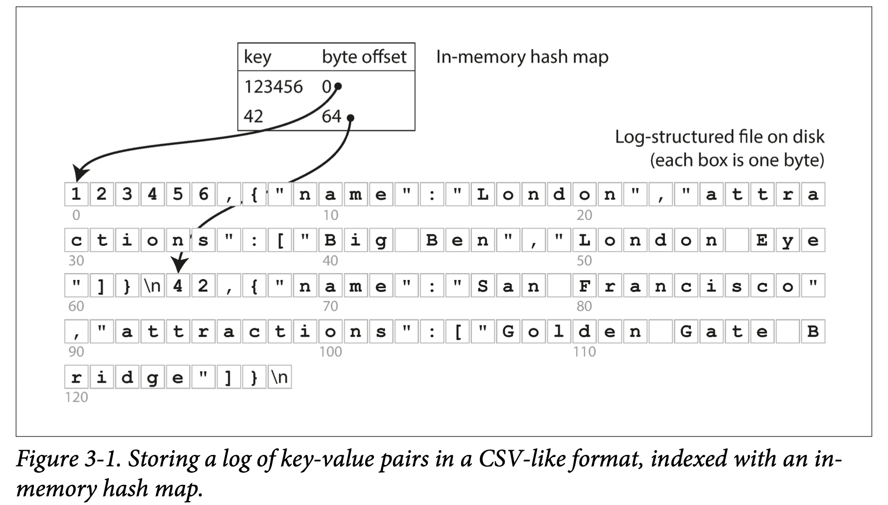

# Chapter 3 Storage and Retrieval

In Chapter 2 we discussed data models and query languages—i.e., the format in which you (the application developer) give the database your data, and the mechanism by which you can ask for it again later. In this chapter we discuss the same from the **database’s point of view**: how we can **store the data** that we’re given, and how we can **find it again** when we’re asked for it.

## Data Structures That Power Your Database

In order to efficiently find the value for a particular key in the database, we need a different data structure: an **index**. The general idea behind them is to keep some additional metadata on the side, which acts as a signpost（路标） and helps you to locate the data you want.

An index is an additional structure that is derived from the primary data. Many databases allow you to add and remove indexes, and this doesn’t affect the contents of the database; it only affects the performance of queries. Maintaining additional structures incurs overhead, especially on writes. For writes, it’s hard to beat the performance of simply appending to a file, because that’s the simplest possible write operation. Any kind of index usually slows down writes, because the index also needs to be updated every time data is written. **This is an important trade-off in storage systems: well-chosen indexes speed up read queries, but every index slows down writes.**

### Hash Indexes

Let’s say our data storage consists only of appending to a file, as in the preceding example. Then the simplest possible indexing strategy is this: keep an in-memory hash map where every key is mapped to a byte offset in the data file—the location at which the value can be found

