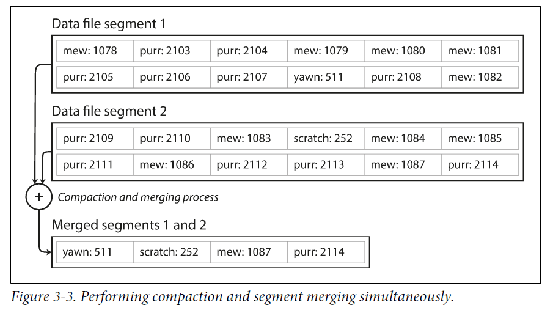

# Chapter 3 Storage and Retrieval

In Chapter 2 we discussed data models and query languages—i.e., the format in which you (the application developer) give the database your data, and the mechanism by which you can ask for it again later. In this chapter we discuss the same from the **database’s point of view**: how we can **store the data** that we’re given, and how we can **find it again** when we’re asked for it.

## 1. Data Structures That Power Your Database

In order to efficiently find the value for a particular key in the database, we need a different data structure: an **index**. The general idea behind them is to keep some additional metadata on the side, which acts as a signpost（路标） and helps you to locate the data you want.

An index is an additional structure that is derived from the primary data. Many databases allow you to add and remove indexes, and this doesn’t affect the contents of the database; it only affects the performance of queries. Maintaining additional structures incurs overhead, especially on writes. For writes, it’s hard to beat the performance of simply appending to a file, because that’s the simplest possible write operation. Any kind of index usually slows down writes, because the index also needs to be updated every time data is written. **This is an important trade-off in storage systems: well-chosen indexes speed up read queries, but every index slows down writes.**

### 1.1 Hash Indexes

Let’s say our data storage consists only of appending to a file. Then the simplest possible indexing strategy is this: keep an in-memory hash map where every key is mapped to a byte offset in the data file—the location at which the value can be found. Whenever you append a new key-value pair to the file, you also update the hash map to reflect the offset of the data you just wrote.

Hash indexes is well suited to situations where the value for each key is updated frequently—there are a lot of writes, but there are not too many distinct keys.

As described so far, we only ever append to a file—so how do we avoid eventually running out of disk space? A good solution is to **break the log into segments of a certain size**. We can then perform **compaction** on these segments. Compaction means throwing away duplicate keys in the log, and **keeping only the most recent update for each key**.

Moreover, since compaction often makes segments much smaller, we can also merge several segments together at the same time as performing the compaction. **The merging and compaction of old segments can be done in a background thread**, and while it is going on, we can still continue to serve read and write requests as normal, using the old segment files. After the merging process is complete, we switch read requests to using the new merged segment instead of the old segments—and then the old segment files can simply be deleted.

**Each segment now has its own in-memory hash table**, mapping keys to file offsets. In order to find the value for a key, we first check the most recent segment’s hash map; if the key is not present we check the second-most-recent segment, and so on.

Some of the issues that are important in a real implementation are:

- Deleting records: If you want to delete a key and its associated value, you have to append a special
  deletion record to the data file.
- Crash recovery: If the database is restarted, the in-memory hash maps are lost. We can store a snapshot of each segment's hash map on disk.
- Partially written records: The database may crash at any time, including halfway through appending a
  record to the log. We can add checksums for records.
- Concurrency control: As writes are appended to the log in a strictly sequential order, a common implementation
  choice is to **have only one writer thread**.

An append-only design turns out to be good for several reasons:

- Appending and segment merging are sequential write operations, which are generally much faster than random writes, especially on magnetic spinning-disk hard drives.
- Concurrency and crash recovery are much simpler if segment files are appendonly or immutable. For example, you don’t have to worry about the case where a crash happened while a value was being overwritten, leaving you with a file containing part of the old and part of the new value spliced together.
- Merging old segments avoids the problem of data files getting fragmented（碎片化） over time.

However, the hash table index also has limitations:

- The hash table must fit in memory, so if you have a very large number of keys, you’re out of luck. In principle, you could maintain a hash map on disk, but unfortunately it is difficult to make an on-disk hash map perform well. It
  requires a lot of random access I/O, it is expensive to grow when it becomes full, and hash collisions require complex logic.
- Range queries are not efficient. For example, you cannot easily scan over all keys between `kitty00000` and `kitty99999`—you’d have to look up each key individually in the hash maps.

### 1.2 SSTables and LSM-Trees

In Figure 3-3, each log-structured storage segment is a sequence of key-value pairs. Now we can make a simple change to the format of our segment files: we require that the sequence of key-value pairs is *sorted by key*. We call this format **Sorted String Table (SSTable)**. We also require that each key only appears once within each merged segment file (the compaction process already ensures that). SSTables have several big advantages over log segments with hash indexes:

- Merging segments is simple and efficient, even if the files are bigger than the available memory. The approach is like the one used in the *mergesort* algorithm.

  

  When multiple segments contain the same key, we can keep the value from the most recent segment and discard the values in older segments.

- In order to find a particular key in the file, you no longer need to keep an index of all the keys in memory. You still need an in-memory index to tell you the offsets for some of the keys, but it can be sparse: one key for every few kilobytes of segment file is sufficient, because a few kilobytes can be scanned very quickly.

  

Constructing and maintaining SSTables:

- When a write comes in, add it to an in-memory balanced tree data structure (for example, a red-black tree). This in-memory tree is sometimes called a **memtable**.
- When the memtable gets bigger than some threshold—typically a few megabytes—write it out to disk as an SSTable file. This can be done efficiently because the tree already maintains the key-value pairs sorted by key. The new SSTable file becomes the most recent segment of the database. While the SSTable is being written out to disk, writes can continue to a new memtable instance.
- In order to serve a read request, first try to find the key in the memtable, then in the most recent on-disk segment, then in the next-older segment, etc.
- From time to time, run a merging and compaction process in the background to combine segment files and to discard overwritten or deleted values.

It only suffers from one problem: if the database crashes, the most recent writes (which are in the memtable but not yet written out to disk) are lost. In order to avoid that problem, we can keep a separate log on disk to which every write is immediately appended, just like in the previous section. That log is not in sorted order. Every time the memtable is written out to an SSTable, the corresponding log can be discarded.

Performance optimizations

- the LSM-tree algorithm can be slow when looking up keys that do not exist in the database: you have to check the memtable, then the segments all the way back to the oldest before you can be sure that the key does not exist. In order to optimize this kind of access, storage engines often use additional **Bloom filters**.
- There are also different strategies to determine the order and timing of how SSTables are compacted and merged. The most common options are **size-tiered** and **leveled** compaction. LevelDB and RocksDB use leveled compaction. In size-tiered compaction, newer and smaller SSTables are successively merged into older and larger SSTables. In leveled compaction, the key range is split up into smaller SSTables and older data is moved into separate “levels”, which allows the compaction to proceed more incrementally and use less disk space. [LevelDB之Leveled-Compaction](https://blog.csdn.net/songchuwang1868/article/details/103935065)

## 2. Transaction Processing or Analytics?

The term **transaction** refers to a group of reads and writes that form a logical unit.

An application typically looks up a small number of records by some key, using an index. Records are inserted or updated based on the user's input. These applications are interactive, the access pattern became known as **online transaction processing (OLTP)**.

However, an analytic query needs to scan over a huge number of records, only reading a few columns per record, and calculates aggregate statistics(such as count, sum, or average) rather than returning the raw data on the user. This pattern has been called **online analytic processing (OLAP)**.

### 2.1 Data Warehousing

At first, the same databases were used for both transaction processing and analytic queries. In the late 1980s and early 1990s, there was a trend for companies to stop using their OLTP systems for analytics purposes, and to run the analytics on a separate database instead. This separate data‐ base was called a **data warehouse**.

The data warehouse contains a read-only copy of the data in all the various OLTP systems in the company. Data is extracted from OLTP databases, transformed into an analysis-friendly schema, cleaned up, and then loaded into the data warehouse. This process of getting data into the warehouse is known as **Extract–Transform–Load (ETL)**.

A big advantage of using a separate data warehouse, rather than querying OLTP systems directly for analytics, is that the data warehouse can be optimized for analytic access patterns. Indexing algorithms work well for OLTP, but are not very good at answering analytic queries.

### 2.2 Stars and Snowflakes: Schemas for Analytics

Many data warehouses are used in a fairly formulaic style, known as a **star schema** (also known as dimensional modeling).

At the center of the schema is a so-called fact table (in this example, it is called fact_sales). Each row of the fact table represents an event that occurred at a particular time. Some of the columns in the fact table are attributes, such as the price at which the product was sold and the cost of buying it from the supplier. Other columns in the fact table are foreign key references to other tables, called **dimension tables**. As each row in the fact table represents an event, the dimensions represent the who, what, where, when, how, and why of the event.

The name “star schema” comes from the fact that when the table relationships are visualized, the fact table is in the middle, surrounded by its dimension tables. A variation of this template is known as the snowflake schema, where dimensions are further broken down into subdimensions.

In a typical data warehouse, tables are often very wide: fact tables often have over 100 columns, sometimes several hundred.

## 3. Column-Oriented Storage

