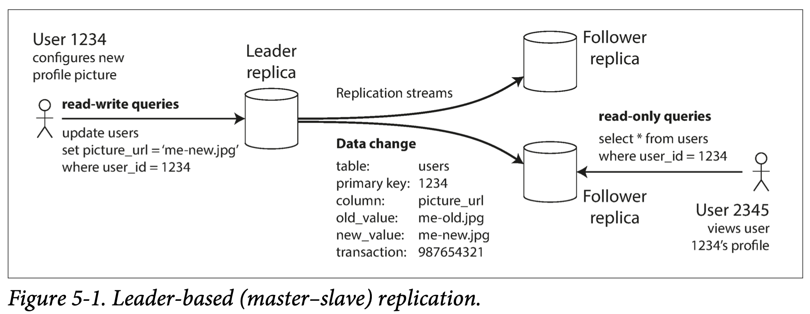

# Chapter 5 Replication

*Replication* means keeping a copy of the same data on multiple machines that are connected via a network. There are several reasons why you might want to replicate data:

- To keep data geographically close to your users (reduce latency)
- To allow the system to continue working even if some of its parts have failed (increase availability)
- To scale out the number of machines that can serve read queries (increase read throughput)

All of the difficulty in replication lies in handling changes to replicated data. We will discuss three popular algorithms for replicating changes between nodes: *single-leader*, *multi-leader*, and *leaderless* replication.

## 5.1 Leaders and Followers

Every write to the database needs to be processed by every replica; otherwise, the replicas would no longer contain the same data. The most common solution for this is called *leader-based replication*.It works as follows:

1. One of the replicas is designated（指定） the *leader*. When clients want to write to the database, they must send their requests to the leader, which first writes the new data to its local storage.
2. The other replicas are known as *followers*. Whenever the leader writes new data to its local storage, it also sends the data change to all of its followers as part of a *replication log*. Each follower takes the log from the leader and updates its local copy of the database accordingly, by applying all writes **in the same order** as they were processed on the leader.
3. When a client wants to read from the database, it can query either the leader or any of the followers. However, writes are only accepted on the leader.

### 5.1.1 Synchronous Versus Asynchromous Replication

An important detail of a replicated system is whether the replication happens *synchronous* or *asynchronous*.

In the example of Figure 5-2, the replication to follower 1 is *synchronous*: the leader waits until follower 1 has confirmed that it received the write before reporting success to the user, and before making the write visible to other clients. The replication to follower 2 is *asynchronous*: the leader sends the message, but doesn’t wait for a response from the follower. There is a delay before follower 2 processes the message, but there is no guarantee of how long it might take.

- The **advantage** of synchronous replication: The follower is guaranteed to have an up-to-date copy of the data that is consistent with the leader. 

- The **disadvantage** of synchronous replication: If the synhronous follower doesn't respond, the write cannot be processed. The leader must block all writes and wait.

In practice, if you enable synchronous replication on a database, it usually means that **one** of the followers is synchronous, and the others are asynchronous. If the synchronous follower becomes unavailable or slow, one of the asynchronous followers is made synchronous. This configuration is sometimes also called *semi-synchronous*（半同步）.

Often, leader-based replication is configured to be completely asynchronous. In this case, if the leader fails and is not recoverable, any writes that have not yet been replicated to followers are lost. However, a fully asynchronous configura‐ tion has the advantage that the leader can continue processing writes, even if all of its followers have fallen behind.

### 5.1.2 Setting Up New Followers

From time to time, you need to set up new followers—perhaps to increase the number of replicas, or to replace failed nodes. The process looks like this:

1. Take a consistent snapshot of the leader's database at some point in time.
2. Copy the snapshot to the new follower node.
3. The follower connects to the leader and requests all the data changes that have happend since the snapshot was taken.
4. When the follower has processed the backlog of data changes since the snapshot, we say it has *caught up*. It can now continue to process data changes from the leader as they happen.

### 5.1.3 Handling Node Outages

Our goal is to keep the system as a whole running despite individual node failures, and to keep the impact of a node outages as small as possible. How to achieve high availability with leader-based replication?

#### Follower failure: Catch-up recovery

On its local disk, each follower keeps a log of the data changes it has received from the leader. If a follower crashes and is restarted, it can recover easily: from its log, it knows the last transaction that was processed before the fault occurred. Thus, the follower can connect to the leader and request all the data changes that occurred during the time when the follower was disconnected.

#### Leader failure: Failover

Handling a failure of the leader is trickier: one of the followers needs to be promoted to be the new leader, clients need to be reconfigured to send their writes to the new leader, and the other followers need to start consuming data changes from the new leader. This process is called *failover*. An automatic failover process usually consists of the following steps:

1. *Determining that the leader has failed*. Most systems simply use a timeout: nodes frequently bounce（反弹） messages back and forth between each other, and if a node doesn't repond for some period of time—say, 30 seconds—it is assumed dead.
2. *Chossing a new leader*. This could be done through an election process. The best candidate for leadership is usually the replica with the most up-do-date data changes from the older leader.
3. *Reconfiguring the system to use the new leader*. Clients now need to send their write requesets to the new leader. If the old leader comes back, the system needs to ensure that the old leader becomes a follower and recognizes the new leader.

Failover is full with thing that can go wrong:

- If asynchronous replication is used, the new leader may not have received all the writes from the old leader before it failed. The most common solution is to discard the old leader's unreplicated writes.
- In certain scenarios, it could happen that two nodes both believe that they are the leader. This situation is called *split brain*（脑裂）. As a safety catch, some systems have a mechanism to shut down one node if two leaders are detected.

### 5.1.4 Implementation of Replication Logs

#### Statement-based replication（基于 SQL）

In the simplest case, the leader logs every write request (*statement*) that it executes and sends that statement log to its followers (INSERT, UPDATE, or DELETE). Follower parses and executes that SQL statement as if it had been received from a client.

There are various ways in which this approach to replication can break down:

- Any statement that calls a nondeterministic function, such as `NOW()` or `RAND()`, is likely to generate a different value on each replica.
- If statements use an autoincrementing column, or if they depend on the existing data in the database, they must be executed in exactly the same order on each replica, or else the may have a different effect.
- Statements that have side effects (e.g., triggers, stored procedures, user-defined functions) may result in different side effects occurring on each replica, unless the side effects are absolutely deterministic.

Statement-based replication was used in MySQL before version 5.1, but it now switches to row-based replication.

#### Write-ahead log (WAL) shipping （基于物理日志）

Usually every write is appended to a log:

- In the case of a log-structured storage engine, this log is the main place for storage.
- In the case of B-tree, every modification is first written to a write-ahead log so that the index can be restored to a consistent state after a crash (RedoLog in InnoDB, redo log 是物理日志，记录的是“在某个数据页上做了什么修改”；binlog 是逻辑日志，记录的是这个语句的原始逻辑，比如“给 ID=2 这一行的 c 字段加 1 ”).

The log is an append-only sequence of bytes containing all writes to the database. We can use the exact same log to build a replica on another node.

This method of replication is used in PostgreSQL and Oracle. The main **disadvantage** is that the log describes the data on a very low level: a WAL contains details of which bytes were changed in which disk blocks. This makes replication closely coupled to the storage engine. If the database changes its storage format from one version to another, it is typically not possible to run different versions of the database software on the leader and the followers.

That may seem like a minor implementation detail, but it can have a big operational impact. If the replication protocol allows the follower to use a newer software version than the leader, you can perform a zero-downtime upgrade of the database software by first upgrading the followers and then performing a failover to make one of the upgraded nodes the new leader. If the replication protocol does not allow this version mismatch, as is often the case with WAL shipping, such upgrades require downtime.

#### Logical (row-based) log replication （基于逻辑日志）

*Logical log*: use different log formats for replication and for the storage engine, which allows the replication log to be decoupled from the storage engine internals.

A logical log for a relational database is usually a sequence of records describing writes to database tables at the granularity of a **row**.

A transaction that modifies several rows generates several such log records, followed by a record indicating that the transaction was committed. MySQL's binlog uses this approach.

A logical log allows the leader and the follower to run different versions of the database software, or even different storage engines. A logical log format is also easier for external applications to parse（消费 binlog）.

#### Trigger-based replication

The replication approaches described so far are implemented by the database system, if you want to only replicate a subset of the data, or want to replicate from one kind of database to another, then you may need to move replication up to the application layer.

A trigger lets you register custom application code that is automatically executed when a data change (write transaction) occurs in a database system. Trigger-based replication has greater overheads than other replication methods, and is more prone to bugs.

## 5.2 Problems with Replication Lag

If an application read from an **asynchronous** follower, it may see outdated information if the follower has fallen behind. This leads to apparent inconsistencies in the database. This inconsistency is just a temporary state—if you stop writing to the databse and wait a while, the followers will eventually catch up and become consistent with the leader. For that reason, this effect is known as *eventual consistency*.

When the lag is so large, the inconsistencies it introduces are not just a theoretical issue but a real problem for applications. In this section we will highlight three exam‐ ples of problems that are likely to occur when there is replication lag.

### 5.2.1 Reading Your Own Writes

If the user views the data shortly after making a write, the new data may not yet have reached the replica.

In this situation, we need *read-after-write consistency*, also known as *read-your-writes consistency*. This is a guarantee that if the user reloads the page, they will always see any updates they submitted themselves. It makes no promises about other users: other users’ updates may not be visible until some later time.

How can we implement read-after-write consistency?

- When reading something that the user may have modified, read it from the leader; otherwise, read it from a follower. For example, user profile information on a social network is normally only editable by the owner of the profile, not by anybody else. Thus, a simple rule is: always read the user’s own profile from the leader, and any other users’ profiles from a follower.
- The client can remember the timestamp of its most recent write—then the system can ensure that the replica serving any reads for that user reflects updates at least until that timestamp.

*Cross-device* read-after-write consistency: if the user enters some information on one device and then views it on another device, they should see the information they just entered. In this case, there are some additional issues to consider:

- Approaches that require remembering the timestamp of the user’s last update become more difficult, because the code running on one device doesn’t know what updates have happened on the other device.
- If your replicas are distributed across different datacenters, there is no guarantee that connections from different devices will be routed to the same datacenter.

### 5.2.2 Monotonic Reads

It's possible for a user to see things *moving backward in time*. This can happen if a suer makes several reads from different replicas.

It's confusing for user 2345 if ther first see user 1234's comment appear, and then see it disappear again.

*Monotonic reads* is a guarantee that this kind of anomaly（异常） does not happen. It’s a lesser guarantee than strong consistency, but a stronger guarantee than eventual con‐ sistency. When you read data, you may see an old value; monotonic reads only means that if one user makes several reads in sequence, they will not read older data after having previously read newer data.

One way of achieving monotonic reads is to make sure that each user always makes their reads from the same replica (different users can read from different replicas). For example, the replica can be chosen based on a hash of the user ID, rather than randomly.

### 5.2.3 Consistent Prefix Reads

Our third example of replication lag anomalies concerns violation of causality（因果关系）.

To the observer it looks as though Mrs. Cake is answering the question before Mr. Poons has even asked it.

*consistent prefix reads* says that if a sequence of writes happens in a certain order, then anyone reading those writes will see them appear in the same order. This is a particular problem in partitioned (sharded) databases.

One solution is to make sure that any writes that are causally related to each other are written to the same partition.

## 5.3 Multi-Leader Replication

Leader-based replication has one major downside: there is only one leader, and all writes must go through it. If you can’t connect to the leader for any reason, you can’t write to the database. 

Multi-leader configuration: allow more than one node to accept writes, each node that pro‐ cesses a write must forward that data change to all the other nodes. In this setup, each leader simultaneously acts as a follower to the other leaders.

### 5.3.1 Use Cases for Multi-Leader Replication

It rarely makes sense to use a multi-leader setup within a single datacenter, because the benefits rarely outweigh the added complexity. However, there are some situations in which this configuration is reasonable.

#### Multi-datacenter operation

Imagine you have a database with replicas in several different datacenter. In a multi-leader configuration, you can hava a leader in *each* datacenter. Within each datacenter, regular leader-follower replication is used; between datacenter, each datacenter's leader replicates its changes to the leaders in other datacenters.

Let’s compare how the single-leader and multi-leader configurations fare in a multi-datacenter deployment:

- *Performance*: In a single-leader configuration, every write must go over the internet to the datacenter with the leader. This can add significant latency to writes. In a multi-leader configuration, every write can be processed in the local datacenter and is replicated asynchronously to the other datacenters. Thus, the inter-datacenter network delay is hidden from users.
- *Tolerance of datacenter outages*: In a single-leader configuration, if the datacenter with the leader fails, failover can promote a follower in another datacenter to be leader. In a multi-leader con‐ figuration, each datacenter can continue operating independently of the others, and replication catches up when the failed datacenter comes back online.
- *Tolerance of network problems*: Traffic between datacenters usually goes over the public internet. A single-leader configuration is very sensitive to problems in this inter-datacenter link, because writes are made synchronously over this link. A multi-leader configuration with asynchronous replication can usually tolerate network problems better.

Although multi-leader replication has advantages, it also has a big downside: the same data may be concurrently modified in two different datacenters, and those write conflicts must be resolved.

#### Clients with offline operation

Another situation in which multi-leader replication is appropriate is if you have an application that needs to continue to work while it is disconnected from the internet. （滴答清单，日历等应用）

If you make any changes while you are offline, they need to be synced with a server and your other devices when the device is next online. In this case, every device has a local database that acts as a leader (it accepts write requests), and there is an asynchronous multi-leader replication process (sync) between the replicas of your calendar on all of your devices.

#### Collaborative editing

*Real-time collaborative editing* applications allow several people to edit a document simultaneously. When one user edits a document, the changes are instantly applied to their local replica (the state of the document in their web browser or client application) and asynchronously replicated to the server and any other users who are editing the same document.

### 5.3.2 Handling Write Conflicts

The biggest problem with multi-leader replication is that write conflicts can occur, which means that conflict resolution is required.

In a multi-leader setup, both writes are successful, and the conflict is only detected asynchronously at some later point in time. At that time, it may be too late to ask the user to resolve the conflict.

#### Conflict avoidance

The simplest strategy for dealing with conflicts is to avoid them: if the application can ensure that all writes for a particular record go through the same leader, then con‐ flicts cannot occur.

However, sometimes you might want to change the designated leader for a record. In this situation, conflict avoidance breaks down, and you have to deal with the possibility of concurrent writes on different leaders.

#### Converging（趋于一致） toward a consistent state

A single-leader database applies writes in a sequential order: if there are several updates to the same field, the last write determines the final value of the field.

In a multi-leader configuration, there is no defined ordering of writes, so it’s not clear what the final value should be. Thus, the database must resolve the conflict in a convergent way, which means that all replicas must arrive at the same final value when all changes have been replicated.

There are various ways of achieving convergent conflict resolution:

- Give each write a unique ID, pick the write with the highest ID as the *winner*, and throw away the other writes. If a timestamp is used, this technique is known as *last write wins* (LWW). Although this approach is popular, it is dangerously prone to data loss.
- Give each replica a unique ID, and let writes that originated at a higher-numbered replica always take precedence over writes that originated at a lower-numbered replica. This approach also implies data loss.
- Somehow merge the values together—e.g., order them alphabetically and then concatenate them
- Record the conflict in an explicit data structure that preserves all information, and write application code that resolves the conflict at some later time (perhaps by prompting the user).

#### Custom conflict resolution logic

As the most appropriate way of resolving a conflict may depend on the application, most multi-leader replication tools let you write conflict resolution logic using application code. That code may be executed on write or on read:

- *On write*: As soon as the database system detects a conflict in the log of replicated changes, it calls the conflict handler.
- *On read*: When a conflict is detected, all the conflicting writes are stored. The next time the data is read, these multiple versions of the data are returned to the application. The application may prompt the user or automatically resolve the conflict.

*Operational transformation* is the conflict resolution algorithm behind collaborative editing applications such as [Etherpad](https://github.com/ether/etherpad-lite/blob/e2ce9dc/doc/easysync/easysync-full-description.pdf) and [Google Docs](http://googledrive.blogspot.com/2010/09/whats-different-about-new-google-docs.html).

### 5.3.3 Multi-Leader Replication Topologies

A *replication topology* describes the communication paths along which writes are propagated from one node to another. With more than two leaders, various different topologies are possible.

The most general topology is *all-to-all*, in which every leader sends its writes to every other leader. However, MySQL by default supports only a *circular topology*. 

In circular and star topologies, a write may need to pass through several nodes before it reaches all replicas. To prevent infinite replication loops, each node is given a unique identifier, and in the replication log, each write is tagged with the identifiers of all the nodes it has passed through. When a node receives a data change that is tagged with its own identifier, that data change is ignored, because the node knows that it has already been processed.

A problem with circular and star topologies is that if just one node fails, it can inter‐ rupt the flow of replication messages between other nodes. The topology could be reconfigured manually.

On the other hand, all-to-all topologies can have issues too. In particular, some net‐ work links may be faster than others (e.g., due to network congestion), with the result that some replication messages may “overtake” others.

This is a problem of causality: the update depends on the prior insert, so we need to make sure that all nodes process the insert first. Simply attaching a timestamp to every write is not sifficient, because clocks cannot be trusted to be sufficiently in sync to correctly order these events at leader 2.

To order these events correctly, a technique called *version vectors* can be used. However, conflict detection techniques are poorly implemented in many multi-leader replication systems.

## 5.4 Leaderless Replication

Some data storage systems take a different approach, abandoning the concept of a leader and allowing any replica to directly accept writes from clients.

In some leaderless implementations, the client directly sends its writes to several rep‐ licas, while in others, a coordinator node does this on behalf of the client. However, unlike a leader database, that coordinator does not enforce a particular ordering of writes.

### 5.4.1 Writing to the Database When a Node Is Down

In a leaderless configuration, failover does not exist. The client (user 1234) sends the write to all three replicas in parallel, and the two available replicas accept the write but the unavailable replica misses it. Let’s say that it’s sufficient for two out of three replicas to acknowledge the write: after user 1234 has received two *ok* responses, we consider the write to be successful. The client simply ignores the fact that one of the replicas missed the write.

When a client reads from the database, it doesn’t just send its request to one replica: read requests are also sent to several nodes in parallel. The cli‐ ent may get different responses from different nodes. Version numbers are used to determine which value is newer.

#### Read repair and anti-entropy

The replication schema should ensure that evenaually all the data is copied to every replica. After an unavailable node comes back online, how does it catch up on the writes that it missed?

- Read repair: When a client makes a read from several nodes in parallel, it can detect any stale responses. For example, in Figure 5-10, user 2345 sees that replica 3 has a stale value and writes the newer value back to that replica. This approach works well for values that are frequently read.
- Anti-entropy process: In addition, some datastores have a background process that constantly looks for differences in the data between replicas and copies any missing data from one replica to another. This anti-entropy process does not copy writes in any particular order, and there may be a significant delay before data is copied.

#### Quorums（法定人数） for reading and writing

If we know that every successful write is guaranteed to be present on at least two out of three replicas, that means at most one replica can be stale. Thus, if we read from at least two replicas, we can be sure that at least one of the two is up to date. 

More generally, if there are $n$ Replicas, every write must be confirmed by $w$ nodes to be considered successful, and we must query at least $r$ nodes for each read. As long as $w + r > n$, we expect to get an up-to-date value when reading. Reads and writes that obey these $r$ and $w$ values are called *quorum* reads and writes.

A common choice is to make $n$ an odd number (typically 3 or 5) and to set $w = r = (n+1) / 2$ (rounded up).

Normally, reads and writes are always sent to all $n$ Replicas in parallel. The parameters $w$ and $r$ detemine how many nodes we wait for—i.e., how many of the $n$ nodes need to report success before we consider the read or write to be successful.

### 5.4.2 Limitations of Quorum Consistency

Often, $r$ and $w$ are chosen to be a majority (more than $n/2$) of nodes, because that ensures $w+r>n$ while still tolerating up to $n/2$ node failures.

You may also set $w$ and $r$ to smaller numbers, so that $w+r\leq n$. In  this case, reads and writes will still be sent to $n$ nodes, but a smaller number of successful responses is required for the operation to succeed. With a smaller $w$ and $r$ you are more likely to read stale values, but this configuration allows lower latency and higher availability.

However, even with $w+r>n$, there are likely to be edge cases where stale values are returned. These depend on the implementation, but possible scenarios include:

- If a sloppy quorum is used, the $w$ Writes may end up on different nodes than the $r$ reads, so there is no longer a guaranteed overlap between the $r$ nodes and the $w$ nodes.
- If two writes occur concurrently, it is not clear which one happeded first. In this case, the only safe solution is to merge the concurrent writes. If a winner is picked based on a timestamp (last write wins), writes can be lost due to clock skew.
- If a write happens concurrently with a read, the write may be reflected on only some of the replicas. In this case, it’s undetermined whether the read returns the old or the new value.

The parameters $w$ and $r$ allow you to adjust the probability of stale values being read, but it’s wise to not take them as absolute guarantees.

#### Monitoring staleness

From an operational perspective, it’s important to monitor whether your databases are returning up-to-date results.

For leader-based replication, the database typically exposes metrics for the replication lag, which you can feed into a monitoring system. This is possible because writes are applied to the leader and to followers in the same order, and each node has a position in the replication log. By subtracting a follower’s current position from the leader’s current position, you can measure the amount of replication lag.

However, in systems with leaderless replication, there is no fixed order in which writes are applied, which makes monitoring more difficult. Moreover, if the database only uses read repair (no anti-entropy), there is no limit to how old a value might be—if a value is only infrequently read, the value returned by a stale replica may be ancient.

### 5.4.3 Spolly（不严谨的） Quorums and Hinted Handoff

Quorums make databases with leaderless replication appealing for use cases that require high availability and low latency, and that can tolerate occasional stale reads.

However, quorums are not as fault-tolerant as they could be. In a large cluster (with significantly more than $n$ nodes) it's likely that the client can connect to some database nodes during the network interruption, just not to the nodes that it needs to assemble a quorum for a particular value. In that case, database designers face a trade-off:

- Is it better to return errors to all requests for which we cannot reach a quorum of $w$ or $r$ nodes?
- Or should we accept writes anyway, and write them to some nodes that are reachable but aren’t among the $n$ nodes on which the value usually lives?

The latter is known as a *sloppy quorum*: writes and reads still require $w$ and $r$ successful responses, but those may include nodes that are not among the designated $n$ “home” nodes for a value.

Once the network interruption is fixed, any writes that one node temporarily accepted on behalf of another node are sent to the appropriate “home” nodes. This is called *hinted handoff*.

However, this means that even when $w + r > n$, you cannot be sure to read the latest value for a key, because the latest value may have been temporarily written to some nodes outside of $n$.

Sloppy quorums are optional in all common Dynamo implementations. In Riak they are enabled by default, and in Cassandra and Voldemort they are disabled by default. 

#### Multi-datacenter operation

Leaderless replication is also suitble for multi-datacenter operation.

Cassandra and Voldemort implement their multi-datacenter support within the normal leaderless model: the number of replicas $n$ includes nodes in all datacenters, and in the configuration you can specify how many of the $n$ replicas you want to have in each datacenter. Each write from a client is sent to all replicas, regardless of datacenter, but the client usually only waits for acknowledgment from a quorum of nodes within its local datacenter so that it is unaffected by delays and interruptions on the cross-datacenter link.

### 5.4.4 Detecting Concurrent Writes

Dynamo-style databases allow several clients to concurrently write to the same key, which means that conflicts will occur even if strict quorums are used. The problem is that events may arrive in a different order at different nodes, due to variable network delays and partial failures.

If each node simply overwrote the value for a key whenever it received a write request from a client, the nodes would become permanently inconsistent, as shown by the final *get* request in Figure 5-12.

In order to become eventually consistent, the replicas should converge toward the same value. How do they do that?

#### Last write wins (discarding concurrent writes)

Each replica need only store the most “recent” value and allow “older” values to be overwritten and discarded. Then, as long as we have some way of unambiguously determining which write is more “recent,” and every write is eventually copied to every replica, the replicas will eventually converge to the same value.

In the example of Figure 5-12, neither client knew about the other one when it sent its write requests to the database nodes, so it’s not clear which one happened first. In fact, it doesn’t really make sense to say that either happened “first”: we say the writes are concurrent, so their order is undefined.

Even though the writes don’t have a natural ordering, we can force an arbitrary order on them. For example, we can attach a timestamp to each write, pick the biggest timestamp as the most “recent,” and discard any writes with an earlier timestamp. This conflict resolution algorithm, called *last write wins* (LWW), is the only supported conflict resolution method in Cassandra, and an optional feature in Riak.

LWW achieves the goal of eventual convergence, but at the cost of durability: if there are several concurrent writes to the same key, only one of the writes will survive and the others will be silently discarded. The only safe way of using a database with LWW is to ensure that a key is only writ‐ ten once and thereafter treated as immutable.

#### The "happens-before" relationship and concurrency

How do we decide whether two operations are concurrent or not?

An operation A *happens before* another operation B if B knows about A, or depends A, or builds upon A in some way. We can simply say that two operations are *concurrent* if neither happens before the other (i.e., neither knows about the other).

If one operation happened before another, the later operation should overwrite the earlier operation, but if the operations are concurrent, we have a conflict that needs to be resolved.

#### Capturing the happens-before relationship

Figure 5-13 shows two clients concurrently adding items to the same shopping cart.

The server can determine whether two operations are concurrent by looking at the version numbers—it does not need to interpret the value itself.

- The server maintains a version number for every key, increments the version number every time that key is written, and stores the new version number along with the value written.
- When a client reads a key, the server returns all values that have not been overwritten, as well as the latest version number. A client must read a key before writing.
- When a client writes a key, it must include the version number from the prior read, and it must merge together all values that it received in the prior read.
- When the server receives a write with a particular version number, it can overwrite all values with that version number or below (since it knows that they have been merged into the new value), but it must keep all values with a higher ver‐ sion number (because those values are concurrent with the incoming write).

When a write includes the version number from a prior read, that tells us which pre‐ vious state the write is based on.

#### Merging concurrently written values

This algorithm ensures that no data is silently dropped, but it unfortunately requires that the clients do some extra work: if several operations happen concurrently, clients have to clean up afterward by merging the concurrently written values. Riak calls these concurrent values *siblings*. How to merge sibling values?

A simple approach is to just pick one of the values based on a version number or timestamp (last write wins), but that implies losing data.

With the example of a shopping cart, a reasonable approach to merging siblings is to just take the union. However, if you want to allow people to also remove things from their carts, and not just add things, then taking the union of siblings may not yield the right result. To prevent this problem, an item cannot simply be deleted from the database when it is removed; instead, the system must leave a marker with an appropriate version number to indicate that the item has been removed when merging siblings.

#### Version vectors

The example in Figure 5-13 used only a single replica. How does the algorithm change when there are multiple replicas, but no leader?

Figure 5-13 uses a single version number, we need to use a version number *per replica* as well as per key. Each replica increments its own version number when processing a write, and also keeps track of the version numbers it has seen from each of the other replicas. This information indicates which values to overwrite and which values to keep as siblings.

The collection of version numbers from all the replicas is called a *version vector*. Version vectors are sent from the database replicas to clients when values are read, and need to be sent back to the database with a value is subsequently written. The version vector allows the database to distinguish between overwrites and concurrent writes.

