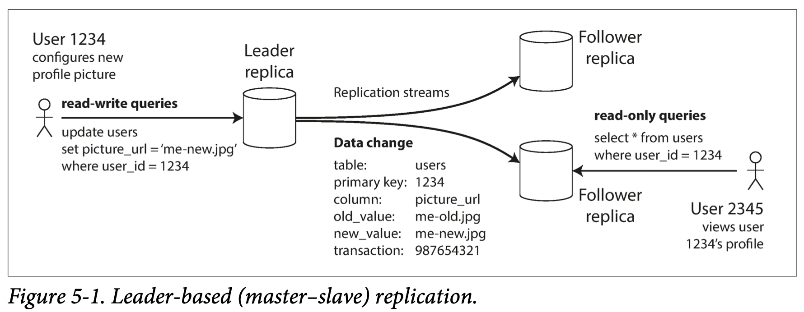
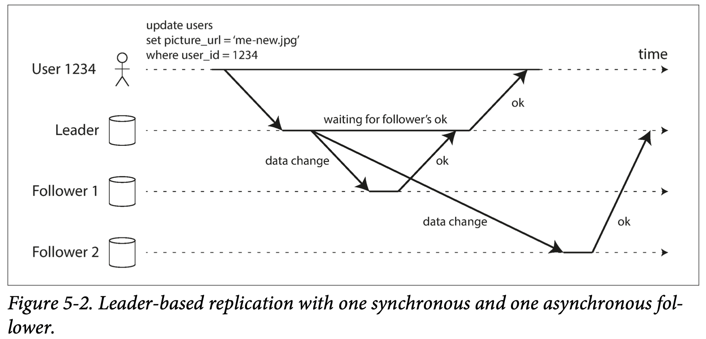
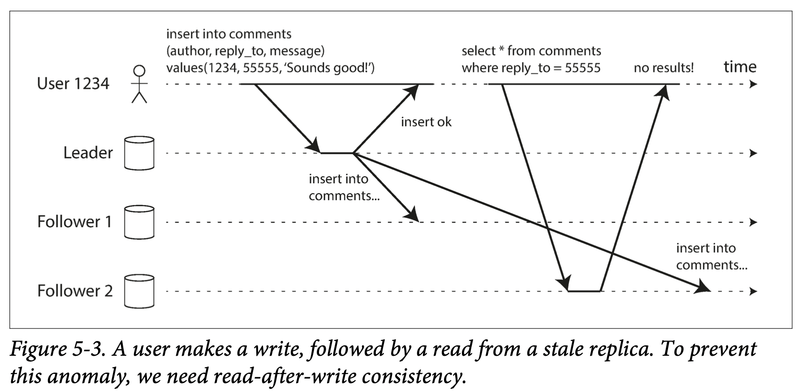
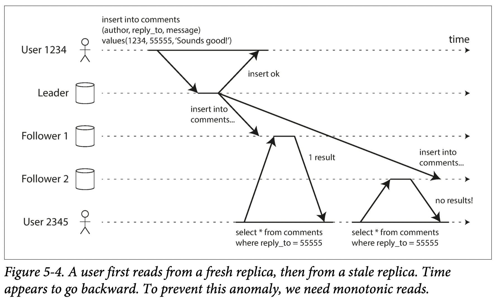
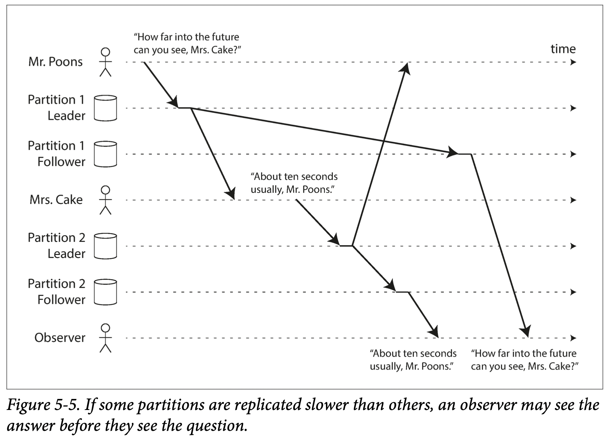

# Chapter 5 Replication

*Replication* means keeping a copy of the same data on multiple machines that are connected via a network. There are several reasons why you might want to replicate data:

- To keep data geographically close to your users (reduce latency)
- To allow the system to continue working even if some of its parts have failed (increase availability)
- To scale out the number of machines that can serve read queries (increase read throughput)

All of the difficulty in replication lies in handling changes to replicated data. We will discuss three popular algorithms for replicating changes between nodes: *single-leader*, *multi-leader*, and *leaderless* replication.

## 5.1 Leaders and Followers

Every write to the database needs to be processed by every replica; otherwise, the replicas would no longer contain the same data. The most common solution for this is called *leader-based replication*.It works as follows:

1. One of the replicas is designated（指定） the *leader*. When clients want to write to the database, they must send their requests to the leader, which first writes the new data to its local storage.
2. The other replicas are known as *followers*. Whenever the leader writes new data to its local storage, it also sends the data change to all of its followers as part of a *replication log*. Each follower takes the log from the leader and updates its local copy of the database accordingly, by applying all writes **in the same order** as they were processed on the leader.
3. When a client wants to read from the database, it can query either the leader or any of the followers. However, writes are only accepted on the leader.

### 5.1.1 Synchronous Versus Asynchromous Replication

An important detail of a replicated system is whether the replication happens *synchronous* or *asynchronous*.

In the example of Figure 5-2, the replication to follower 1 is *synchronous*: the leader waits until follower 1 has confirmed that it received the write before reporting success to the user, and before making the write visible to other clients. The replication to follower 2 is *asynchronous*: the leader sends the message, but doesn’t wait for a response from the follower. There is a delay before follower 2 processes the message, but there is no guarantee of how long it might take.

- The **advantage** of synchronous replication: The follower is guaranteed to have an up-to-date copy of the data that is consistent with the leader. 

- The **disadvantage** of synchronous replication: If the synhronous follower doesn't respond, the write cannot be processed. The leader must block all writes and wait.

In practice, if you enable synchronous replication on a database, it usually means that **one** of the followers is synchronous, and the others are asynchronous. If the synchronous follower becomes unavailable or slow, one of the asynchronous followers is made synchronous. This configuration is sometimes also called *semi-synchronous*（半同步）.

Often, leader-based replication is configured to be completely asynchronous. In this case, if the leader fails and is not recoverable, any writes that have not yet been replicated to followers are lost. However, a fully asynchronous configura‐ tion has the advantage that the leader can continue processing writes, even if all of its followers have fallen behind.

### 5.1.2 Setting Up New Followers

From time to time, you need to set up new followers—perhaps to increase the number of replicas, or to replace failed nodes. The process looks like this:

1. Take a consistent snapshot of the leader's database at some point in time.
2. Copy the snapshot to the new follower node.
3. The follower connects to the leader and requests all the data changes that have happend since the snapshot was taken.
4. When the follower has processed the backlog of data changes since the snapshot, we say it has *caught up*. It can now continue to process data changes from the leader as they happen.

### 5.1.3 Handling Node Outages

Our goal is to keep the system as a whole running despite individual node failures, and to keep the impact of a node outages as small as possible. How to achieve high availability with leader-based replication?

#### Follower failure: Catch-up recovery

On its local disk, each follower keeps a log of the data changes it has received from the leader. If a follower crashes and is restarted, it can recover easily: from its log, it knows the last transaction that was processed before the fault occurred. Thus, the follower can connect to the leader and request all the data changes that occurred during the time when the follower was disconnected.

#### Leader failure: Failover

Handling a failure of the leader is trickier: one of the followers needs to be promoted to be the new leader, clients need to be reconfigured to send their writes to the new leader, and the other followers need to start consuming data changes from the new leader. This process is called *failover*. An automatic failover process usually consists of the following steps:

1. *Determining that the leader has failed*. Most systems simply use a timeout: nodes frequently bounce（反弹） messages back and forth between each other, and if a node doesn't repond for some period of time—say, 30 seconds—it is assumed dead.
2. *Chossing a new leader*. This could be done through an election process. The best candidate for leadership is usually the replica with the most up-do-date data changes from the older leader.
3. *Reconfiguring the system to use the new leader*. Clients now need to send their write requesets to the new leader. If the old leader comes back, the system needs to ensure that the old leader becomes a follower and recognizes the new leader.

Failover is full with thing that can go wrong:

- If asynchronous replication is used, the new leader may not have received all the writes from the old leader before it failed. The most common solution is to discard the old leader's unreplicated writes.
- In certain scenarios, it could happen that two nodes both believe that they are the leader. This situation is called *split brain*（脑裂）. As a safety catch, some systems have a mechanism to shut down one node if two leaders are detected.

### 5.1.4 Implementation of Replication Logs

#### Statement-based replication（基于 SQL）

In the simplest case, the leader logs every write request (*statement*) that it executes and sends that statement log to its followers (INSERT, UPDATE, or DELETE). Follower parses and executes that SQL statement as if it had been received from a client.

There are various ways in which this approach to replication can break down:

- Any statement that calls a nondeterministic function, such as `NOW()` or `RAND()`, is likely to generate a different value on each replica.
- If statements use an autoincrementing column, or if they depend on the existing data in the database, they must be executed in exactly the same order on each replica, or else the may have a different effect.
- Statements that have side effects (e.g., triggers, stored procedures, user-defined functions) may result in different side effects occurring on each replica, unless the side effects are absolutely deterministic.

Statement-based replication was used in MySQL before version 5.1, but it now switches to row-based replication.

#### Write-ahead log (WAL) shipping （基于物理日志）

Usually every write is appended to a log:

- In the case of a log-structured storage engine, this log is the main place for storage.
- In the case of B-tree, every modification is first written to a write-ahead log so that the index can be restored to a consistent state after a crash (RedoLog in InnoDB, redo log 是物理日志，记录的是“在某个数据页上做了什么修改”；binlog 是逻辑日志，记录的是这个语句的原始逻辑，比如“给 ID=2 这一行的 c 字段加 1 ”).

The log is an append-only sequence of bytes containing all writes to the database. We can use the exact same log to build a replica on another node.

This method of replication is used in PostgreSQL and Oracle. The main **disadvantage** is that the log describes the data on a very low level: a WAL contains details of which bytes were changed in which disk blocks. This makes replication closely coupled to the storage engine. If the database changes its storage format from one version to another, it is typically not possible to run different versions of the database software on the leader and the followers.

That may seem like a minor implementation detail, but it can have a big operational impact. If the replication protocol allows the follower to use a newer software version than the leader, you can perform a zero-downtime upgrade of the database software by first upgrading the followers and then performing a failover to make one of the upgraded nodes the new leader. If the replication protocol does not allow this version mismatch, as is often the case with WAL shipping, such upgrades require downtime.

#### Logical (row-based) log replication （基于逻辑日志）

*Logical log*: use different log formats for replication and for the storage engine, which allows the replication log to be decoupled from the storage engine internals.

A logical log for a relational database is usually a sequence of records describing writes to database tables at the granularity of a **row**.

A transaction that modifies several rows generates several such log records, followed by a record indicating that the transaction was committed. MySQL's binlog uses this approach.

A logical log allows the leader and the follower to run different versions of the database software, or even different storage engines. A logical log format is also easier for external applications to parse（消费 binlog）.

#### Trigger-based replication

The replication approaches described so far are implemented by the database system, if you want to only replicate a subset of the data, or want to replicate from one kind of database to another, then you may need to move replication up to the application layer.

A trigger lets you register custom application code that is automatically executed when a data change (write transaction) occurs in a database system. Trigger-based replication has greater overheads than other replication methods, and is more prone to bugs.

## 5.2 Problems with Replication Lag

If an application read from an **asynchronous** follower, it may see outdated information if the follower has fallen behind. This leads to apparent inconsistencies in the database. This inconsistency is just a temporary state—if you stop writing to the databse and wait a while, the followers will eventually catch up and become consistent with the leader. For that reason, this effect is known as *eventual consistency*.

When the lag is so large, the inconsistencies it introduces are not just a theoretical issue but a real problem for applications. In this section we will highlight three exam‐ ples of problems that are likely to occur when there is replication lag.

### 5.2.1 Reading Your Own Writes

If the user views the data shortly after making a write, the new data may not yet have reached the replica.

In this situation, we need *read-after-write consistency*, also known as *read-your-writes consistency*. This is a guarantee that if the user reloads the page, they will always see any updates they submitted themselves. It makes no promises about other users: other users’ updates may not be visible until some later time.

How can we implement read-after-write consistency?

- When reading something that the user may have modified, read it from the leader; otherwise, read it from a follower. For example, user profile information on a social network is normally only editable by the owner of the profile, not by anybody else. Thus, a simple rule is: always read the user’s own profile from the leader, and any other users’ profiles from a follower.
- The client can remember the timestamp of its most recent write—then the system can ensure that the replica serving any reads for that user reflects updates at least until that timestamp.

*Cross-device* read-after-write consistency: if the user enters some information on one device and then views it on another device, they should see the information they just entered. In this case, there are some additional issues to consider:

- Approaches that require remembering the timestamp of the user’s last update become more difficult, because the code running on one device doesn’t know what updates have happened on the other device.
- If your replicas are distributed across different datacenters, there is no guarantee that connections from different devices will be routed to the same datacenter.

### 5.2.2 Monotonic Reads

It's possible for a user to see things *moving backward in time*. This can happen if a suer makes several reads from different replicas.

It's confusing for user 2345 if ther first see user 1234's comment appear, and then see it disappear again.

*Monotonic reads* is a guarantee that this kind of anomaly（异常） does not happen. It’s a lesser guarantee than strong consistency, but a stronger guarantee than eventual con‐ sistency. When you read data, you may see an old value; monotonic reads only means that if one user makes several reads in sequence, they will not read older data after having previously read newer data.

One way of achieving monotonic reads is to make sure that each user always makes their reads from the same replica (different users can read from different replicas). For example, the replica can be chosen based on a hash of the user ID, rather than randomly.

### 5.2.3 Consistent Prefix Reads

Our third example of replication lag anomalies concerns violation of causality（因果关系）.

To the observer it looks as though Mrs. Cake is answering the question before Mr. Poons has even asked it.

*consistent prefix reads* says that if a sequence of writes happens in a certain order, then anyone reading those writes will see them appear in the same order. This is a particular problem in partitioned (sharded) databases.

One solution is to make sure that any writes that are causally related to each other are written to the same partition.

## 5.3 Multi-Leader Replication

Leader-based replication has one major downside: there is only one leader, and all writes must go through it. If you can’t connect to the leader for any reason, you can’t write to the database. 

Multi-leader configuration: allow more than one node to accept writes, each node that pro‐ cesses a write must forward that data change to all the other nodes. In this setup, each leader simultaneously acts as a follower to the other leaders.

### 5.3.1 Use Cases for Multi-Leader Replication

