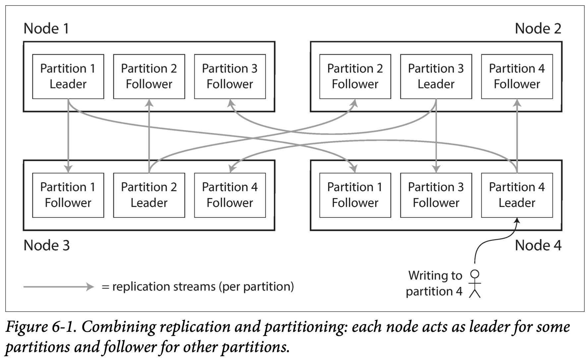
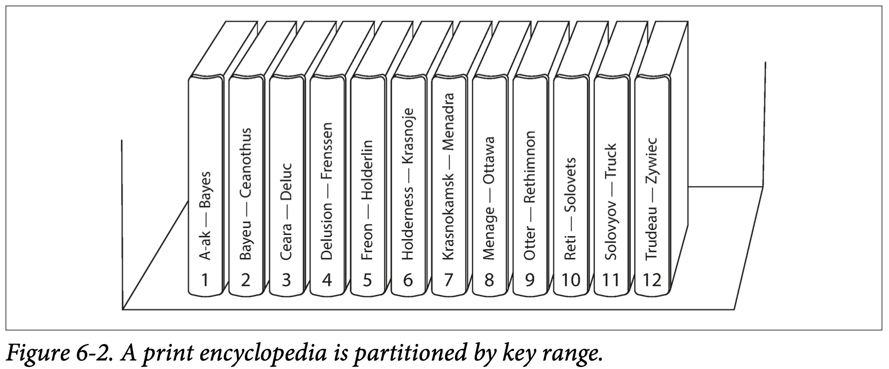
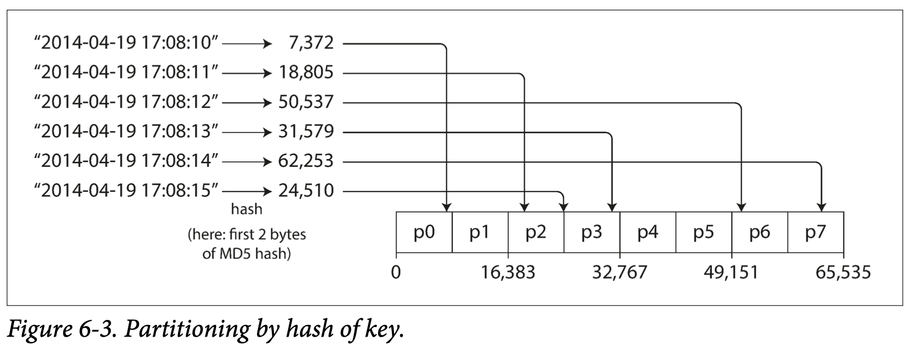

# Chapter 6 Partitioning

In chapter 5 we discussed replication—that is, having multiple copies of the same data on different nodes. For very large datasets, or very high query throughput, that is not sufficient: we need to break the data up into *partitions*, also known as *sharding*.

The main reason for wanting to partition data is *scalability*. Different partitions can be placed on different nodes in a shared-nothing cluster. Thus, a large dataset can be distributed across many disks, and the query load can be distributed across many processors.

In this chapter we will first look at different approaches for partitioning large datasets and observe how the indexing of data interacts with partitioning. We’ll then talk about rebalancing, which is necessary if you want to add or remove nodes in your cluster. Finally, we’ll get an overview of how databases route requests to the right par‐ titions and execute queries.

## 6.1 Partitioning and Replication

Partitioning is usually combined with replication so that copies of each partition are stored on multiple nodes. This means that, even though each record belongs to exactly one partition, it may still be stored on several different nodes for fault tolerance.

A node may store more than one partition. If a leader-follower replication model is used, the combination of partitiong and replication can look like Figure 6-1. Each node may be the leader for some partitions and a follower for other partitions.

TiDB 也采用这样的架构

## 6.2 Partitioning of Key-Value Data

Our goal with partitioning is to spread the data and the query load evenly across nodes. If the partitiong is unfair, so that some partitions have more data or queries than others, we call it *skewed*（倾斜的）. A partition with disproportionately load is called a *hot spot*.

The simplest approach for avoiding hot spots would be to assign records to nodes **randomly**. That would distribute the data quite evenly across the nodes, but it has a big disadvantage: when you’re trying to read a particular item, you have no way of knowing which node it is on, so you have to query all nodes in parallel.

 ### 6.2.1 Partition by Key Range

One way of partitioning is to assign a continous range of keys (from some minimum to some maximum) to each partition. If you know the boundaries between the ranges, you can easily determine which partition contains a given key.

The range of keys are not neccessarily evenly spaced, because your data may not be evenly distributed. For example, in Figure 6-2, volume 1 contains words starting with A and B, but volume 12 contains words starting with T, U, V, X, Y, and Z. In order to distribute the data evenly, the partition boundaries need to adapt to the data.

With each partition, we can keep keys in sorted order (SSTables and LSM Trees). This has the advantage that range scans are easy.

However, the downside of key range partitioning is that certain access patterns can lead to hot spots. If the key is a timestamp (or automated increasing ID), then the partitions correspond to ranges of time—e.g., one partition per day. Unfortunately, because we write data from the sensors to the database as the measurements happen, all the writes end up going to the same partition (the one for today), so that partition can be overloaded with writes while others sit idle.

To avoid this problem in the sensor database, you need to use something other than the timestamp as the first element of the key. For example, you could prefix each timestamp with the sensor name.

### 6.2.2 Partitioning by Hash of Key

Many distributed datastores use a hash function to determine the partition for a given key. A good hash function takes skewed data and makes it uniformly distributed. 

Once you have a suitable hash function for keys, you can assign each partition a range of hashes (rather than a range of keys), and every key whose hash falls within a partition’s range will be stored in that partition.

This technique is good at distributing keys fairly among the partitions. The partition boundaries can be evenly spaced, or they can be chosen pseudorandomly (in which case the technique is sometimes known as consistent hashing).

Unfortunately however, by using the hash of the key for partitioning we lose a nice property of key-range partitioning: the ability to do efficient range queries.

Cassandra achieves a compromise between the two partitioning strategies. A table in Cassandra can be declared with a *compound primary key* consisting of several columns. Only the first part of that key is hashed to determine the partition, but the other columns are used as a concatenated index for sorting the data in Cassandra’s SSTables. A query therefore cannot search for a range of values within the first column of a compound key, but if it specifies a fixed value for the first column, it can perform an efficient range scan over the other columns of the key.

The concatenated index approach enables an elegant data model for one-to-many relationships. For example, on a social media site, one user may post many updates. If the primary key for updates is chosen to be (`user_id, update_timestamp`), then you can efficiently retrieve all updates made by a particular user within some time interval, sorted by timestamp. Different users may be stored on different partitions, but within each user, the updates are stored ordered by timestamp on a single partition.

## 6.3 Partitioning and Secondary Indexes

## 6.4 Rebalancing Partitions

## 6.5 Request Routing

