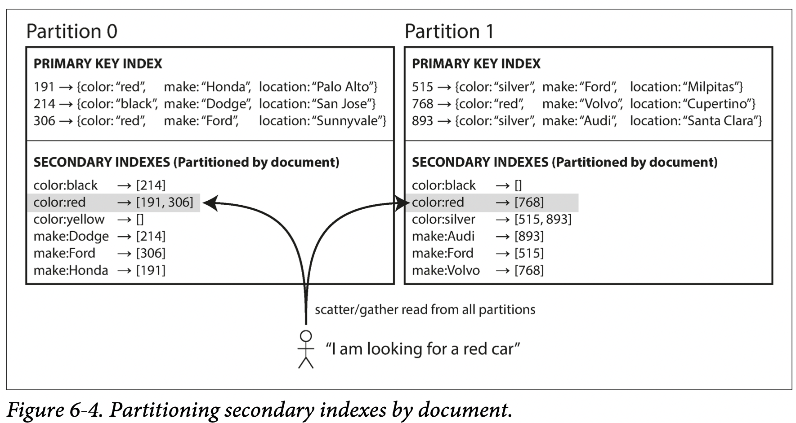
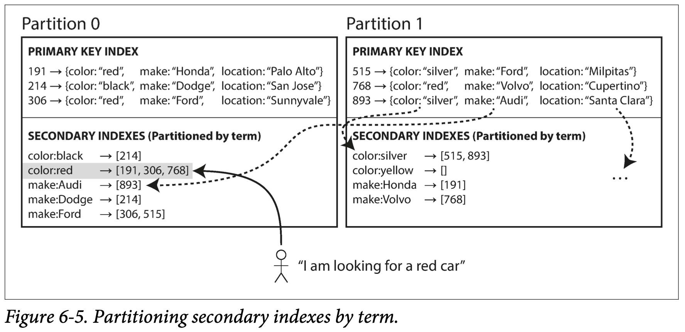
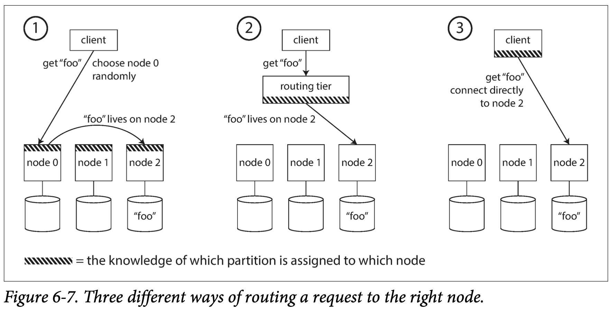
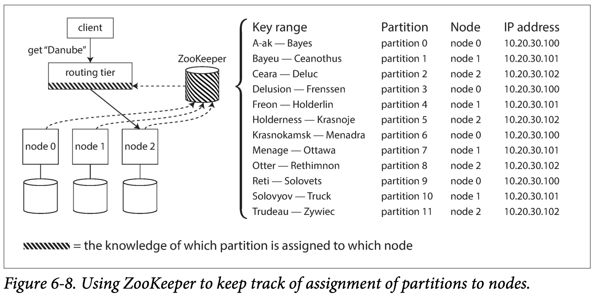

# Chapter 6 Partitioning

In chapter 5 we discussed replication—that is, having multiple copies of the same data on different nodes. For very large datasets, or very high query throughput, that is not sufficient: we need to break the data up into *partitions*, also known as *sharding*.

The main reason for wanting to partition data is *scalability*. Different partitions can be placed on different nodes in a shared-nothing cluster. Thus, a large dataset can be distributed across many disks, and the query load can be distributed across many processors.

In this chapter we will first look at different approaches for partitioning large datasets and observe how the indexing of data interacts with partitioning. We’ll then talk about rebalancing, which is necessary if you want to add or remove nodes in your cluster. Finally, we’ll get an overview of how databases route requests to the right par‐ titions and execute queries.

## 6.1 Partitioning and Replication

Partitioning is usually combined with replication so that copies of each partition are stored on multiple nodes. This means that, even though each record belongs to exactly one partition, it may still be stored on several different nodes for fault tolerance.

A node may store more than one partition. If a leader-follower replication model is used, the combination of partitiong and replication can look like Figure 6-1. Each node may be the leader for some partitions and a follower for other partitions.

TiDB 也采用这样的架构

## 6.2 Partitioning of Key-Value Data

Our goal with partitioning is to spread the data and the query load evenly across nodes. If the partitiong is unfair, so that some partitions have more data or queries than others, we call it *skewed*（倾斜的）. A partition with disproportionately load is called a *hot spot*.

The simplest approach for avoiding hot spots would be to assign records to nodes **randomly**. That would distribute the data quite evenly across the nodes, but it has a big disadvantage: when you’re trying to read a particular item, you have no way of knowing which node it is on, so you have to query all nodes in parallel.

 ### 6.2.1 Partition by Key Range

One way of partitioning is to assign a continous range of keys (from some minimum to some maximum) to each partition. If you know the boundaries between the ranges, you can easily determine which partition contains a given key.

The range of keys are not neccessarily evenly spaced, because your data may not be evenly distributed. For example, in Figure 6-2, volume 1 contains words starting with A and B, but volume 12 contains words starting with T, U, V, X, Y, and Z. In order to distribute the data evenly, the partition boundaries need to adapt to the data.

With each partition, we can keep keys in sorted order (SSTables and LSM Trees). This has the advantage that range scans are easy.

However, the downside of key range partitioning is that certain access patterns can lead to hot spots. If the key is a timestamp (or automated increasing ID), then the partitions correspond to ranges of time—e.g., one partition per day. Unfortunately, because we write data from the sensors to the database as the measurements happen, all the writes end up going to the same partition (the one for today), so that partition can be overloaded with writes while others sit idle.

To avoid this problem in the sensor database, you need to use something other than the timestamp as the first element of the key. For example, you could prefix each timestamp with the sensor name.

### 6.2.2 Partitioning by Hash of Key

Many distributed datastores use a hash function to determine the partition for a given key. A good hash function takes skewed data and makes it uniformly distributed. 

Once you have a suitable hash function for keys, you can assign each partition a range of hashes (rather than a range of keys), and every key whose hash falls within a partition’s range will be stored in that partition.

This technique is good at distributing keys fairly among the partitions. The partition boundaries can be evenly spaced, or they can be chosen pseudorandomly (in which case the technique is sometimes known as consistent hashing).

Unfortunately however, by using the hash of the key for partitioning we lose a nice property of key-range partitioning: the ability to do efficient range queries.

Cassandra achieves a compromise between the two partitioning strategies. A table in Cassandra can be declared with a *compound primary key* consisting of several columns. Only the first part of that key is hashed to determine the partition, but the other columns are used as a concatenated index for sorting the data in Cassandra’s SSTables. A query therefore cannot search for a range of values within the first column of a compound key, but if it specifies a fixed value for the first column, it can perform an efficient range scan over the other columns of the key.

The concatenated index approach enables an elegant data model for one-to-many relationships. For example, on a social media site, one user may post many updates. If the primary key for updates is chosen to be (`user_id, update_timestamp`), then you can efficiently retrieve all updates made by a particular user within some time interval, sorted by timestamp. Different users may be stored on different partitions, but within each user, the updates are stored ordered by timestamp on a single partition.

## 6.3 Partitioning and Secondary Indexes

A secondary index usually doesn't identify a record uniquely but rather is a way of searching for occurances of a particular value. The problem with secondary indexes is that they don’t map neatly to partitions. There are two main approaches to partitioning a database with secondary indexes: document-based partitioning and term-based partitioning.

### 6.3.1 Partitioning Secondary Indexes by Document

For example, imagine you are operating a website for selling used cars (illustrated in Figure 6-4). Each listing has a unique ID—call it the *document ID*—and you partition the database by the document ID (for example, IDs 0 to 499 in partition 0, IDs 500 to 999 in partition 1, etc.).

You want to let users search for cars, allowing them to filter by color and by make, so you need a secondary index on `color` and `make` (in a document database these would be fields; in a relational database they would be columns). Whenever a red car is added to the database, the database partition automatically adds it to the list of document IDs for the index entry `color:red`.

In this indexing approach, each partition is completely separate: each partition main‐ tains its own secondary indexes, covering only the documents in that partition. Whenever you need to write to the database, you only need to deal with the partition that contains the document ID that you are writing. For that reason, a document-partitioned index is also known as a *local index* (as opposed to a *global index*, described in the next section).

However, reading from a document-partitioned index requires care: if you want to search for read cars, you need to send the query to **all** partitions, and combine all the results you get back.

This approach to querying a partitioned database is sometimes known as *scatter/ gather*, and it can make read queries on secondary indexes quite expensive. Nevertheless, it is widely used: MongoDB, Riak, Cassandra, Elasticsearch, and VoltDB all use document-partitioned secondary indexes.

### 6.3.2 Partitioning Secondary Indexes by Term

Rather than each partition having its own secondary index (a *local index*), we can construct a *global index* that covers data in all partitions. However, we can’t just store that index on one node, since it would likely become a bottleneck and defeat the purpose of partitioning. A global index must also be partitioned.

Figure 6-5 illustrates what this could look like: the index is partitioned so that colors starting with the letters *a* to *r* in partition 0 and colors starting with *s* to *z* appear in partition 1.

We call this kind of index *term-partitioned*, because the term we're looking for determines the partition of the index. As before, we can partition the index by the term itself, or using a hash of the term. Partitioning by the term itself can be useful for range scans (e.g., on a numeric property, such as the asking price of the car), whereas partitioning on a hash of the term gives a more even distribution of load.

The advantage of a global (term-partitioned) index over a document-partitioned index is that it can make reads more efficient: rather than doing scatter/gather over all partitions, a client only needs to make a request to the partition containing the term that it wants. However, the downside of a global index is that writes are slower and more complicated, because a write to a single document may now affect multiple partitions of the index (every term in the document might be on a different partition, on a different node).

In an ideal world, the index would always be up to date, and every document written to the database would immediately be reflected in the index. However, in a term-partitioned index, that would require a distributed transaction across all partitions affected by a write, which is not supported in all databases. In practice, updates to global secondary indexes are often asynchronous (that is, if you read the index shortly after a write, the change you just made may not yet be reflected in the index).

## 6.4 Rebalancing Partitions

The process of moving load from one node in the cluster to another is called *rebalancing*.

No matter which partitioning scheme is used, rebalancing is usually expected to meet some minimum requirements:

- After rebalancing, the load (data storage, read and write requests) should be shared fairly between the nodes in the cluster.
- While rebalancing is happening, the database should continue accepting reads and writes.
- No more data than necessary should be moved between nodes, to make rebalancing fast and to minimize the network and disk I/O load.

### 6.4.1 Strategies for Rebalancing

#### How not to do it: hash mod N

When partitioning by the hash of a key, we said earlier (Figure 6-3) that it’s best to divide the possible hashes into ranges and assign each range to a partition (e.g., assign $key$ to partition $0$ if $0 \leq hash(key) < b_0$, to partition $1$ if $b_0 \leq hash(key) < b_1$, etc.).

Perhaps you wondered why we don’t just use *mod* (the % operator in many programming languages). The problem with the mod N approach is that if the number of nodes N changes, most of the keys will need to be moved from one node to another. For example, say $hash(key) = 123456$. If you initially have 10 nodes, that key starts out on node 6 (because $123456 \mod 10 = 6$). When you grow to 11 nodes, the key needs to move to node 3 ($123456\mod 11 = 3$). Such frequent moves make rebalancing excessively expensive.

#### Fixed number of partitions

Fortunately, there is a fairly simple solution: create many more partitions than there are nodes, and assign several partitions to each node. For example, a database running on a cluster of 10 nodes may be split into 1,000 partitions from the outset so that approximately 100 partitions are assigned to each node.

Now, if a node is added to the cluster, the new node can *steal* a few partitions from every existing node until partitions are fairly distributed once again. Only entire partitions are moved between nodes. The number of partitions does not change, nor does the assignment of keys to partitions. The only thing that changes is the assignment of partitions to nodes.

In principle, you can even account for mismatched hardware in your cluster: by assigning more partitions to nodes that are more powerful, you can force those nodes to take a greater share of the load.

In this configuration, the number of partitions is usually fixed when the database is first set up and not changed afterward. Although in principle it’s possible to split and merge partitions (see the next section), a fixed number of partitions is operationally simpler.

Choosing the right number of partitions is difficult if the total size of the dataset is highly variable. If partitions are very large, rebalancing and recovery from node failures become expensive. But if partitions are too small, they incur too much overhead.

#### Dynamic partitioning

For databases that use key range partitioning, a fixed number of partitions with fixed boundaries would be very incon‐ venient: if you got the boundaries wrong, you could end up with all of the data in one partition and all of the other partitions empty.

For that reason, key range–partitioned databases such as HBase and TiDB create partitions dynamically. When a partition grows to exceed a configured size (on HBase, the default is 10 GB), it is split into two partitions so that approximately half of the data ends up on each side of the split. Conversely, if lots of data is deleted and a partition shrinks below some threshold, it can be merged with an adjacent partition.

Each partition is assigned to one node, and each node can handle multiple partitions.  After a large partition has been split, one of its two halves can be transferred to another node in order to balance the load.

An advantage of dynamic partitioning is that the number of partitions adapts to the total data volume.

However, a disadvantage is that an empty database starts off with a single partition, since there is no a *priori* information about where to draw the partition boundaries. While the dataset is small—until it hits the point at which the first partition is split—all writes have to be processed by a single node while the other nodes sit idle. To mitigate this issue, HBase and MongoDB allow an initial set of partitions to be configured on an empty database (this is called *pre-splitting*).

Dynamic partitioning is not only suitable for key range–partitioned data, but can equally well be used with hash-partitioned data. MongoDB since version 2.4 supports both key-range and hash partitioning, and it splits partitions dynamically in either case.

#### Partitioning proportionally to nodes

A third option, used by Cassandra and Ketama, is to make the number of partitions proportional to the number of nodes—in other words, to have a fixed number of partitions per node. In this case, the size of each partition grows proportion‐ ally to the dataset size while the number of nodes remains unchanged, but when you increase the number of nodes, the partitions become smaller again.

When a new node joins the cluster, it randomly chooses a fixed number of existing partitions to split, and then takes ownership of one half of each of those split partitions while leaving the other half of each partition in place. The randomization can produce unfair splits, but when averaged over a larger number of partitions (in Cassandra, 256 partitions per node by default), the new node ends up taking a fair share of the load from the existing nodes.

Picking partition boundaries randomly requires that hash-based partitioning is used (so the boundaries can be picked from the range of numbers produced by the hash function).

### 6.4.2 Operations: Automatic or Manual Rebalancing

There is a gradient（梯度） between fully automatic rebalancing and fully manual. For example, Couchbase, Riak, and Voldemort generate a suggested partition assignment automatically, but require an administrator to commit it before it takes effect.

Fully automated rebalancing can be convenient, because there is less operational work to do for normal maintenance. However, it can be unpredictable. If it is not done carefully, this process can overload the network or the nodes and harm the performance of other requests while the rebalancing is in progress.

## 6.5 Request Routing

When a client wants to make a request, how does it know which node to connect to? As partitions are rebalanced, the assignment of partitions to nodes changes.

On a high level, there are a few different approaches to this problem (illustrated in Figure 6-7):

- Allow clients to contact any node (e.g., via a round-robin load balancer). If that node coincidentally owns the partition to which the request applies, it can handle the request directly; otherwise, it forwards the request to the appropriate node, receives the reply, and passes the reply along to the client.
- Send all requests from clients to a routing tier（层） first, which determines the node that should handle each request and forwards it accordingly. This routing tier does not itself handle any requests; it only acts as a partition-aware load balancer.
- Require that clients be aware of the partitioning and the assignment of partitions to nodes. In this case, a client can connect directly to the appropriate node, without any intermediary.

In all cases, the key problem is: how does the component making the routing decision (which may be one of the nodes, or the routing tier, or the client) learn about changes in the assignment of partitions to nodes? This is a challenging problem, because it is important that all participants agree—otherwise requests would be sent to the wrong nodes and not handled correctly.

Many distributed data systems rely on a separate coordination service such as ZooKeeper to keep track of this cluster metadata, as illustrated in Figure 6-8. Whenever a partition changes ownership, or a node is added or removed, ZooKeeper notifies the routing tier so that it can keep its routing information up to date.

